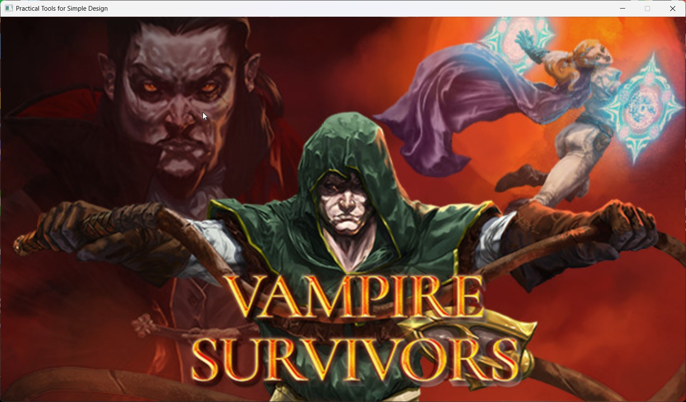
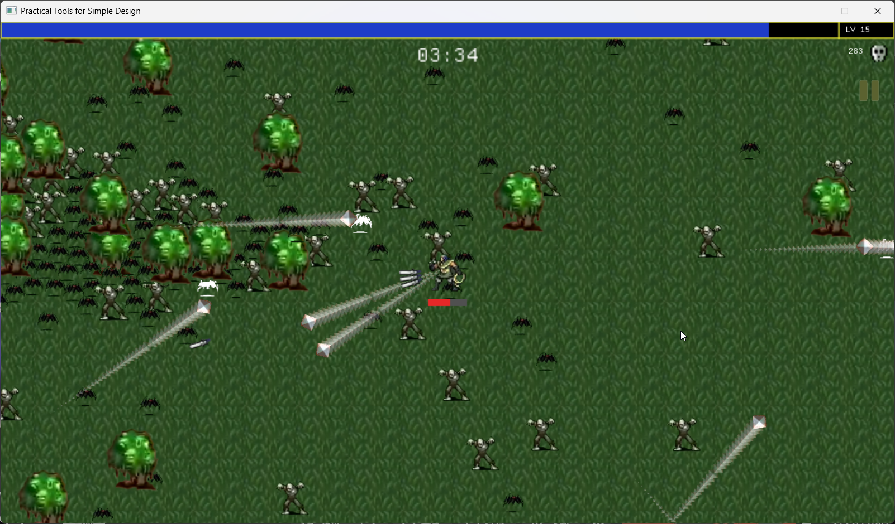
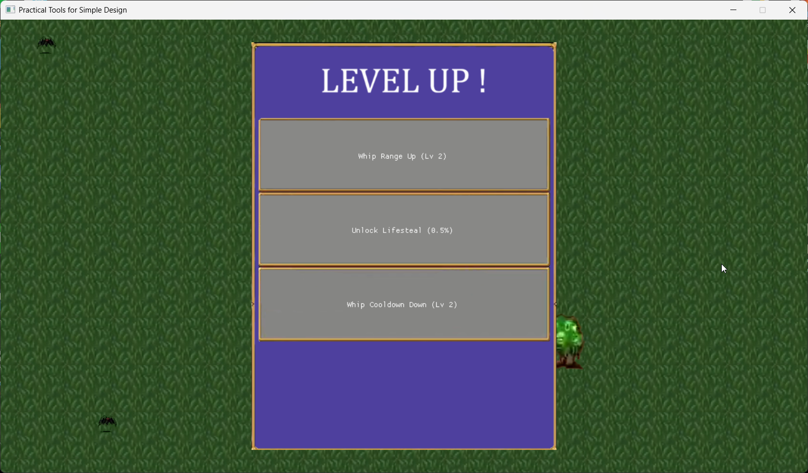
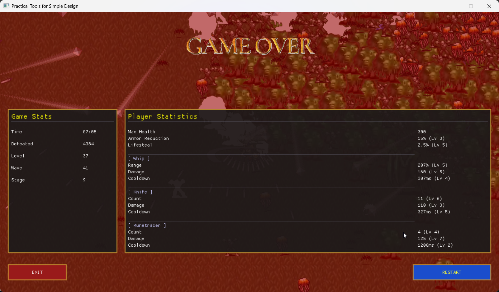

# 2026 OOPL Final Report

## 組別資訊

組別：T33
組員：陳昱霖
復刻遊戲：Vampire Survivors (吸血鬼倖存者)

## 專案簡介

### 遊戲簡介
本專案基於 C++ 與 PTSD 遊戲引擎，復刻了知名獨立遊戲《吸血鬼倖存者》。玩家在一個無限延展的地圖中控制角色，面對如潮水般湧來的怪物。角色的武器會自動進行攻擊，玩家只需專注於走位與躲避。擊敗怪物後會掉落經驗寶石，收集寶石即可升級，並在隨機提供的裝備與屬性升級中進行選擇，目標是打造出最強的配置，盡可能在越來越強的怪物波次中存活下去。

### 組別分工
陳昱霖 1 人

## 遊戲介紹

### 遊戲規則
1. **角色控制**：使用鍵盤 `W`, `A`, `S`, `D` 鍵控制角色的移動方向。
2. **自動攻擊**：武器擁有各自的攻擊範圍、冷卻時間與穿透特性（鞭子、飛刀、符文追蹤者），會自動發動攻擊。
3. **升級系統**：
   * 擊殺敵人會掉落經驗寶石 (Exp Gem)，玩家靠近後會自動吸取。
   * 經驗值滿後會觸發「升級狀態」，遊戲暫停並隨機給予 3 個升級選項（包含解鎖新武器、提升武器傷害/數量/冷卻、增加最大生命、護甲與吸血等被動屬性）。
4. **波次機制**：
   * 遊戲採用波次 (Wave) 系統推進，每擊殺一定數量的敵人就會進入下一波。
   * 隨著波數增加，怪物的血量與攻擊力會大幅提升。
   * 特定波次下會生成高血量與高傷害的 Boss。

### 遊戲畫面

*(圖：遊戲首頁，按下 Enter 開始生存)*

*(圖：遊戲進行中，玩家使用多把武器自動迎擊滿滿的怪物，展現爽快的割草感)*

*(圖：玩家升級時，遊戲自動暫停並跳出三選一的升級介面)*

*(圖：玩家死亡時的 Game Over 畫面，顯示存活時間、擊殺數、等級與屬性)*

## 程式設計

### 程式架構
專案以 `App` 類別為核心，並利用 **Finite State Machine (狀態機)** 的概念分為：
* `State::TITLE`：標題畫面
* `State::START`：初始化遊戲資源
* `State::UPDATE`：核心遊戲迴圈 (處理移動、生成、碰撞、渲染)
* `State::LEVEL_UP`：暫停畫面並處理升級介面
* `State::GAME_OVER`：遊戲結束結算畫面

### 程式技術
1. **物件池 (Object Pooling)**：
   * 為了應對畫面上同時出現數千隻怪物的壓力測試，專案不使用動態的 `new` / `delete`。
   * 取而代之，我們預先在記憶體中宣告了容量達 5000 的 `std::vector<EnemyUnit>`。透過維護每個物件的 `active` 布林標記，當怪物被擊殺時將其設為 `false`，並在需要生成新怪物時優先從 `false` 的物件中提取。這項技術徹底解決了頻繁動態分配記憶體所造成的系統卡頓 (FPS Drop) 與 Memory Leak 問題。
2. **圓形碰撞偵測 (Distance-based Collision) 與 AABB 快速過濾**：
   * 在遊戲主迴圈中，需要頻繁計算玩家與怪物、怪物與怪物之間的推擠與傷害判定。
   * 我們首先採用曼哈頓距離 (Manhattan Distance) 進行 AABB (Axis-Aligned Bounding Box) 快速過濾，篩除絕對不可能碰撞的物件；再進一步利用 `glm::distance` 進行精準的歐式幾何兩點距離計算，搭配各物件的 Scale 換算半徑，實現了極高效率的玩家受擊判定與寶石撿取。
3. **無縫地圖捲動 (Camera Tracking)**：
   * 遊戲中的背景是由數個 Tile 拼接而成。由於地圖是無限大的，我們不實際移動背景。
   * 我們維護了一組 `m_CameraPosition`，所有渲染的實體 GameObject（包括怪物、寶石、武器特效）在畫到螢幕前，其 Transform 的 `translation` 都必須扣除目前的相機位置。這營造出角色永遠保持在螢幕正中央，而整個世界圍繞著他無限移動的視覺錯覺。

### 使用到 AI/AI Agent 的部分
本專案高度使用了 Gemini 作為 Pair Programming 的助手，在多個迭代階段發揮關鍵作用：
* **數值平衡調整與動態難度 (Dynamic Difficulty)**：AI 協助撰寫了隨波次成長的怪物血量與攻擊力公式。使遊戲體驗更加平衡且有挑戰性。
* **遊戲邏輯與 Bug 修正**：AI 能精準理解並追蹤 PTSD 引擎中的 `Play()` 與 `Pause()` 動畫邏輯，解決了我們遇到的各種 Bug（如：升級或死亡時，Boss 動畫仍會繼續播放）。此外，AI 也協助調整了飛刀與符文追蹤者的彈道生成與計算。
* **程式碼重構與維護**：由於經過多次修改，原本的 `App.cpp` 產生了許多冗餘的程式碼與註解。透過 AI 清理無效程式碼與死區 (Dead Code)，確保交付的程式碼具備業界等級的可讀性。

## 結語

### 問題與解決方法
* **效能瓶頸問題**：早期開發時，當畫面上的怪物數量增加到 300 隻以上，遊戲 FPS 就會暴跌到 10 以下，根本無法遊玩。
  * **解決方法**：我們將原本依賴動態建立敵人的作法，改寫為上述提到的 Object Pool 模式。並且在雙層 `for` 迴圈中進行物件互相推擠 (Separation) 的計算時，利用 AABB 搭配 Reference (`auto&`)，減少了 O(N^2) 的無謂遍歷與 Copy 成本，讓數千隻怪物同框也能保持順暢。
* **武器強弱失衡**：在實機測試中，我們發現「小刀」與「鞭子」的攻擊頻率與傷害遠不及怪物後期的血量成長速度，導致玩家若不選特定武器就一定會卡關。
  * **解決方法**：重構了武器數值、武器升級邏輯、怪物生成與強度設定，使得玩家能在前期節奏快速地升級，中期要求一定程度的走位與升級邏輯，後期則能展現極強的割草爽感。
* **後期玩家站樁無敵現象**：原本吸血技能最高可達 15%，加上高護甲，玩家只要站著不動，怪物打出的傷害還不如玩家吸回來的血多，導致遊戲後期變得無聊且缺乏挑戰。
  * **解決方法**：將滿級吸血下調至 7.5%，同時設計新的怪物。這種怪物不會被波次影響基礎傷害，而是造成玩家生命值的百分比傷害。逼迫玩家在後期仍須走位閃躲，提升遊戲的刺激感與操作深度。

### 自評

| 項次 | 項目                   | 完成 |
|------|------------------------|-------|
| 1    | 這是範例               |  V    |
| 2    | 完成專案權限改為 public  |  V    |
| 3    | 具有 debug mode 的功能   |  V    |
| 4    | 解決專案上所有 Memory Leak 的問題  |  V    |
| 5    | 報告中沒有任何錯字，以及沒有任何一項遺漏  |  V    |
| 6    | 報告至少保持基本的美感，人類可讀  |  V    |

### 心得
透過與 AI Agent 的結對程式設計 (Pair Programming)，大大加速了遊戲開發的進程。許多繁瑣的 C++ 語法細節與記憶體管理問題交由 AI 把關，我們因此能夠專注於遊戲設計、數值平衡與核心玩法的打磨上。本次復刻吸血鬼倖存者專案，不僅學到了 Entity 管理與效能優化技巧，更體驗到了結合 AI 進行現代軟體開發的強大威力。

### 貢獻比例
陳昱霖 100%